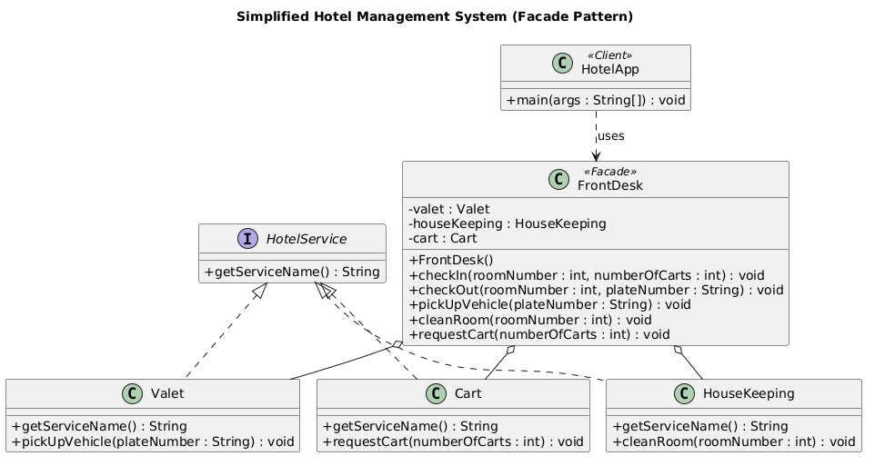

# Simplified Hotel Management System (Facade Pattern)

## Problem Statement

The HotelApp needs to manage various hotel services for guest check-in and check-out. These services include valet parking for vehicles, room cleaning, and handling luggage carts. However, the HotelApp aims to interact with these services through a simplified, single interface provided by the FrontDesk. The FrontDesk class should delegate the client's requests to the appropriate service classes (Valet, HouseKeeping, Cart) while abstracting the service details from the client.

### Class Definitions

- **HotelService (Interface):** Defines the common interface for all hotel services.
- **Valet:** Implements HotelService; responsible for vehicle valet parking and pick-up. Includes `pickUpVehicle(plateNumber)`.
- **HouseKeeping:** Implements HotelService; responsible for room cleaning. Includes `cleanRoom(roomNumber)`.
- **Cart:** Implements HotelService; responsible for luggage cart requests. Includes `requestCart(numberOfCarts)`.
- **FrontDesk:** The facade class that coordinates interactions between the client (HotelApp) and the individual hotel services.
- **HotelApp:** The client class that uses the FrontDesk facade to access hotel services.

## UML Class Diagram

PlantUML source: [docs/hotel-facade.puml](docs/hotel-facade.puml)

## Java Code

All source files are in [src/](src/).

## How to Run

    cd src
    javac *.java
    java HotelApp

## Sample Output

    --- Guest Check-In ---
    [Cart] 2 luggage cart(s) are on the way.
    [HouseKeeping] Room 305 is being cleaned.
    Check-in complete for room 305.

    [Cart] 1 luggage cart(s) are on the way.
    [HouseKeeping] Room 305 is being cleaned.
    --- Guest Check-Out ---
    [Valet] Vehicle with plate number ABC-1234 is being brought to the entrance.
    [HouseKeeping] Room 305 is being cleaned.
    Check-out complete for room 305.
